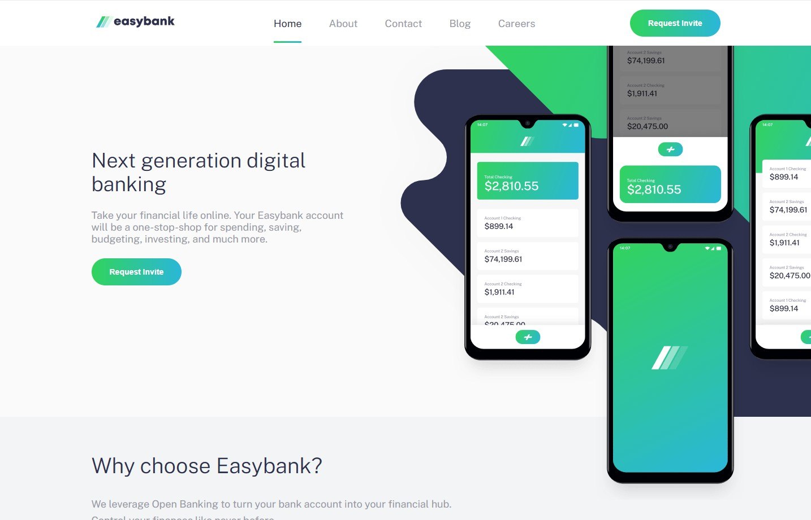

## Table of contents

- [Overview](#overview)
  - [The challenge](#the-challenge)
  - [Screenshot](#screenshot)
  - [Links](#links)
- [My process](#my-process)
  - [Built with](#built-with)
  - [Continued development](#continued-development)

## Overview

### The challenge

Users should be able to:

- View the optimal layout for the site depending on their device's screen size
- See hover states for all interactive elements on the page

### Screenshot

### Links

- Solution URL: [GitHub Repo](https://github.com/gadiedcarrero/bank-app)
- Live Site URL: [Add live site URL here](https://gadied-bank.netlify.app/)

## My process

### Built with

- Semantic HTML5 markup
- SCSS
- Flexbox
- Mobile-first workflow
- [Vue JS](https://vuejs.org/) - JS library

### Continued development

I added a functionality so that when the menu slides down, the screen locks and you can't scroll. The solution works but, the scroll bar disappears, and made a small jump. To solve this I implemented an additional space that covered the space of the scroll bar, in this way I eliminate the jump, but it is not a solution that satisfies me completely. But it is already out of the scope of this test.
